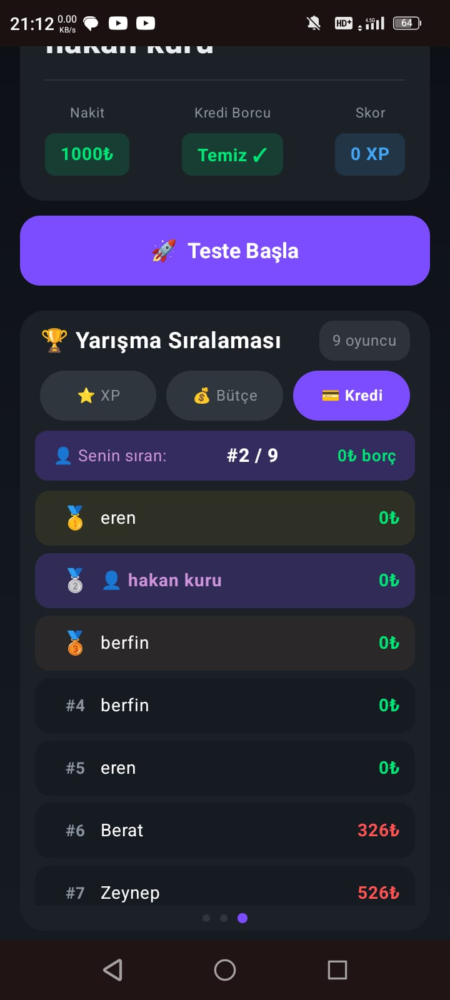
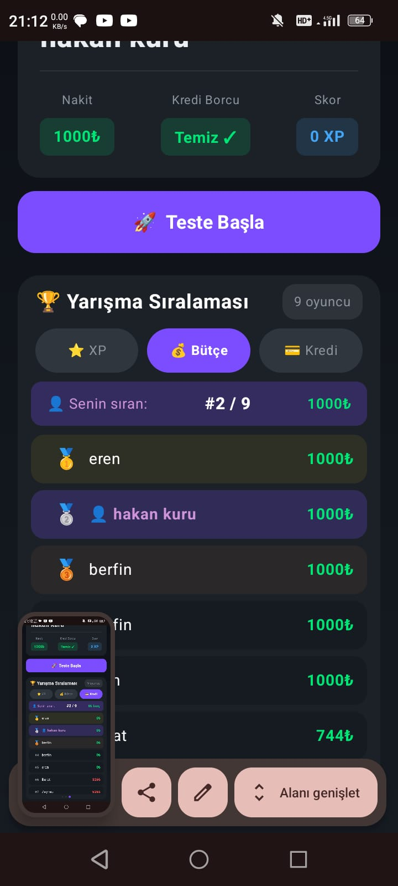
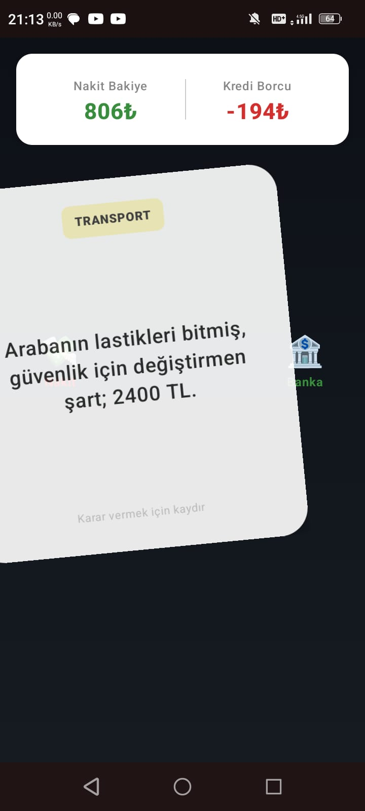
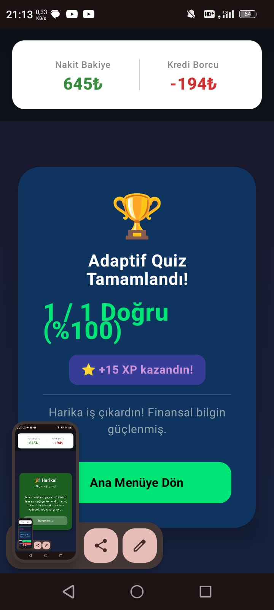
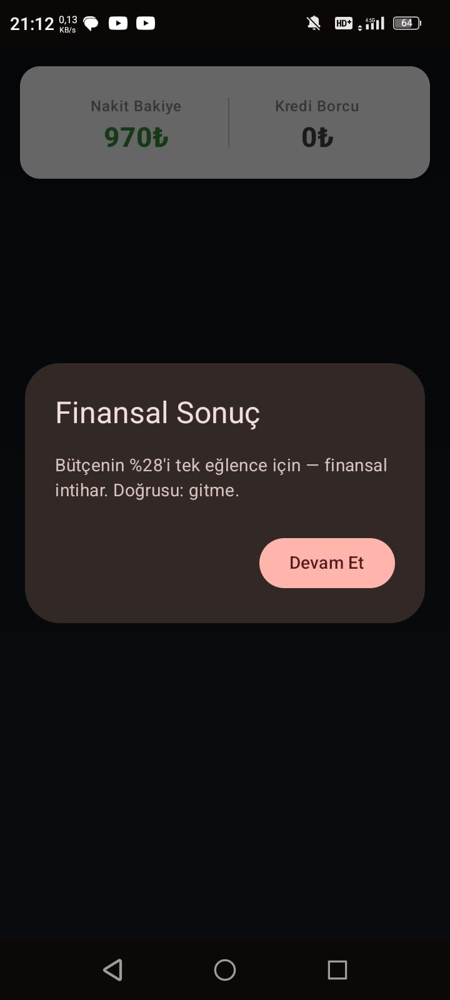
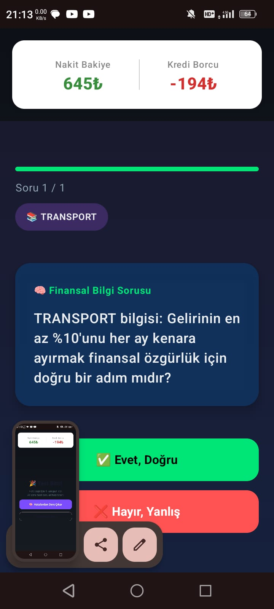
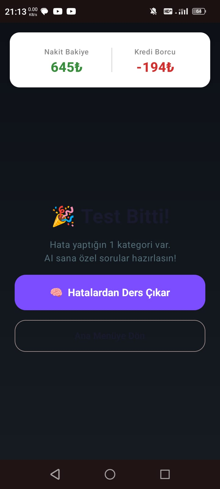
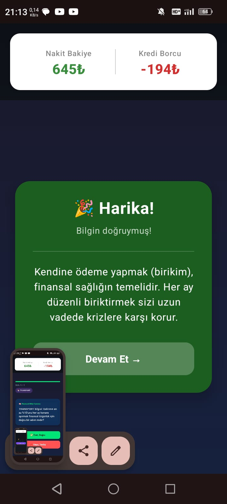

# AgeSA Insurtech Codenight — Adaptive Financial Quiz

Bu proje, **AgeSA Insurtech Codenight** kapsamında **7 saatlik** yoğun bir geliştirme sürecinde hayata geçirilmiştir. Temel amacı, kullanıcıların finansal okuryazarlığını artırmak, bütçe yönetimi konusunda farkındalık kazandırmak ve kişiselleştirilmiş bir öğrenme deneyimi sunmaktır.

---

## 📸 Ekran Görüntüleri (Screenshots)

| Giriş | Ana Ekran | Sıralama |
|:---:|:---:|:---:|
|  |  |  |

| Kaydırmalı Soru | Test Sonucu | Cevap Yorumu |
|:---:|:---:|:---:|
|  |  |  |

| Gemini Sorusu | Hatalarından Ders Çıkar | Test Soru Yorumu |
|:---:|:---:|:---:|
|  |  |  |

---

## 🚀 Proje Hakkında

Bu uygulama, kullanıcıların günlük finansal senaryolarla (alışveriş, BES, birikim vb.) karşılaştığı ve bu durumlarda verdikleri kararlara göre bütçelerini yönettikleri interaktif bir oyundur.

### Ana Özellikler:
- **Adaptif Quiz Sistemi:** Kullanıcının hatalı olduğu kategoriler (maliyet yönetimi, yatırım vb.) tespit edilerek **Google Gemini AI** desteğiyle kişiselleştirilmiş "ekstra öğrenim" soruları üretilir.
- **Swipe-Based UI:** Modern ve akıcı bir kullanıcı deneyimi için Tinder tarzı sağa/sola kaydırarak karar verme mekanizması.
- **Gerçek Zamanlı Liderlik Tablosu:** Firebase altyapısı ile XP, Bütçe ve Kredi Skoru bazında tüm kullanıcılar arasında anlık sıralama.
- **Finansal Koçluk:** AI tarafından üretilen, kararların finansal sonuçlarını açıklayan detaylı geri bildirimler.
- **Gelişmiş Backend:** Node.js tabanlı, oturum yönetimli ve dinamik puanlama sistemine sahip API.

---

## 🛠️ Kullanılan Teknolojiler

### Mobil (Android)
- **Kotlin & Jetpack Compose:** Tamamen deklaratif ve modern UI.
- **Firebase:** Authentication ve Firestore (Realtime Database/Leaderboard).
- **Retrofit & OkHttp:** Backend ile güvenli ve hızlı iletişim.
- **Coroutines & Flow:** Asenkron veri yönetimi.

### Backend (Node.js)
- **Express.js:** API servisleri.
- **Google Gemini API:** Adaptif içerik üretimi ve analiz.
- **In-memory Session Store:** Hızlı oturum takibi.

---

## 📥 Kurulum

### 1. Backend Kurulumu (`/adaptive-quiz`)
```bash
cd adaptive-quiz
npm install
# .env dosyasını oluşturun ve GEMINI_API_KEY ekleyin
npm start
```

### 2. Mobil Uygulama (`/AgeSA_Insurtech_Codenight`)
- Projeyi Android Studio ile açın.
- `google-services.json` dosyasını `app/` dizinine ekleyin.
- Gradle senkronizasyonunu tamamlayın ve çalıştırın.

---

## 🏆 Codenight Deneyimi
Bu proje, kısıtlı sürede (7 saat) en iyi ürün-market uyumu ve teknik derinliği yakalamak amacıyla geliştirilmiştir. Süreç boyunca;
- Problem tespiti ve çözüm mimarisi 1. saatte tamamlandı.
- 4. saatte ana döngü çalışır hale geldi.
- Kalan sürede AI entegrasyonu ve UI cilalaması yapıldı.

---

*Geliştirici: Hakan*
